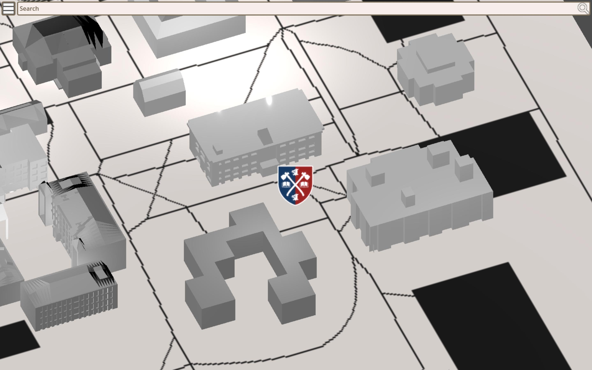

# GeoBlazers

Interactively discover the Acadia University

---

<!--
## Overview

*PH Text*
-->

## Installation

Included are the game files to launch on major platforms, like Windows, Linux,
and Web.

  
Web

  1. Export the project folder zip onto your local machine
  2. Navigate to `./GeoBlazers/exports/x86_64-windows/`.
  3. Serve the application with a webserver with either:
    * Follow [the official](https://docs.godotengine.org/en/stable/tutorials/export/exporting_for_web.html#serving-the-files) installation instructions
    * Run a small python server to try out the application locally
      1. Download the [python webserver](https://raw.githubusercontent.com/godotengine/godot/master/platform/web/serve.py) from the official godotengine repo
          curl -o serve.py https://raw.githubusercontent.com/godotengine/godot/master/platform/web/serve.py
      1. Run the server
          python serve.py --root .

  
Windows

  1. Export the project folder zip onto your local machine
  2. Navigate to `./GeoBlazers/exports/x86_64-windows/`.
  3. Run `geoblazers.exe` (i.e. by double clicking it)

  
Linux

  1. Export the project folder zip onto your local machine
  2. Navigate to `./GeoBlazers/exports/x86_64-linux/`.
  3. Run `geoblazers.sh` (i.e. by double clicking it)

<!--
## Contributing

*PH Contribution Guidelines*
-->

## Licensing

Everything except the documentation in `./docs` is MIT licensed.
The documentation is CC-BY-SA-4.0 licensed.
