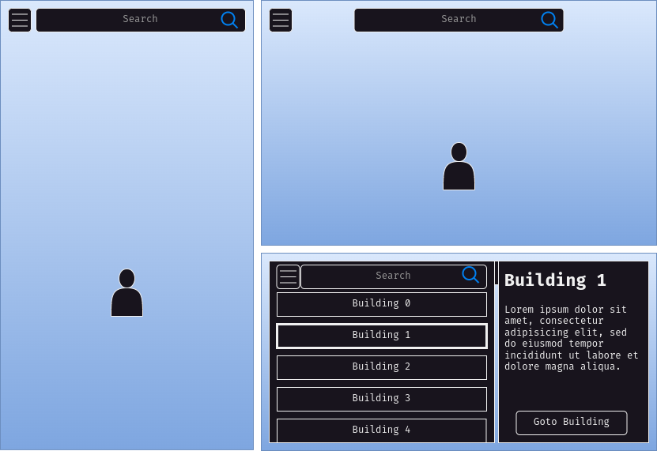

# GeoBlazers

Interactively discover the Acadia University

---

# Our Vision

* Map of the Acadia University
* Game-ified experience
* Data Lookup
* Search Options

---

# Completed Work

* Setup of Discord server for team communication
* Setup of GitHub repo

* Collected first set of User-Stories
* First Map Protoype
* Initial set of 3d-modelled buildings
* Initial set of building metadata collection

---

# Git Usage

* GitHub Repo
  * Issues / Milestone
  * Project Board

---

# Future Work

* Research into multiple build targets
  * Mobile app, desktop app, online app, ...
* Implementing & finalizing the UI
* Finalizing the Map
* UX Studies
  * Data gathering
  * Data analysis
* Writing the Paper

---

# What do you think?

* Possible problems with our approach?
* How would you rate (1 to 10) the utility of our application vision?
  * Why do you give it that rating?
* Anything you'd like us to implement?
